# C4 API Tools

Набор инструментов для работы с API Континент 4: экспорт конфигураций, веб-панель для конфигурации, резервное копирование.

> **ВНИМАНИЕ:** Данный проект предназначен исключительно для образовательных и демонстрационных целей. Не используйте его в продуктивной среде. Конфигурация безопасности (пароли по умолчанию, самоподписанные сертификаты, отключенная верификация TLS) не предназначена для production-развертывания.

## Скриншоты

| Вход | Обзорная панель |
|---|---|
| 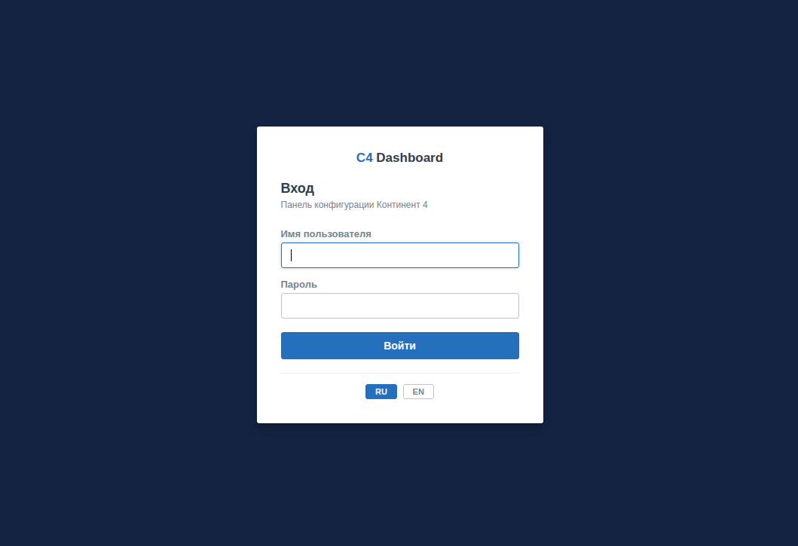 | 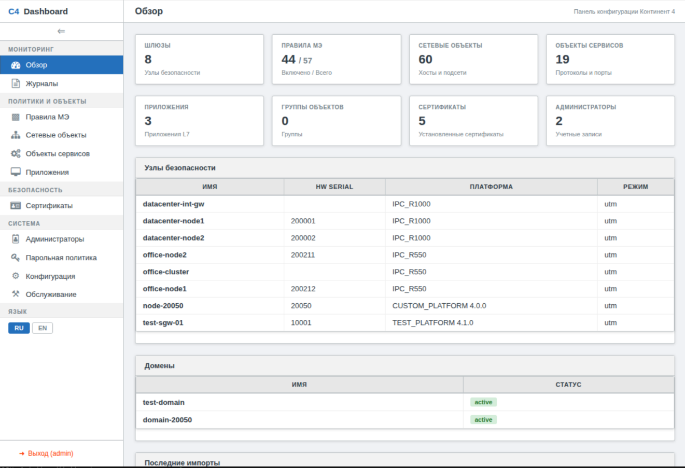 |

| Журналы ЦУС (МЭ) | Журналы ЦУС (системный) |
|---|---|
| 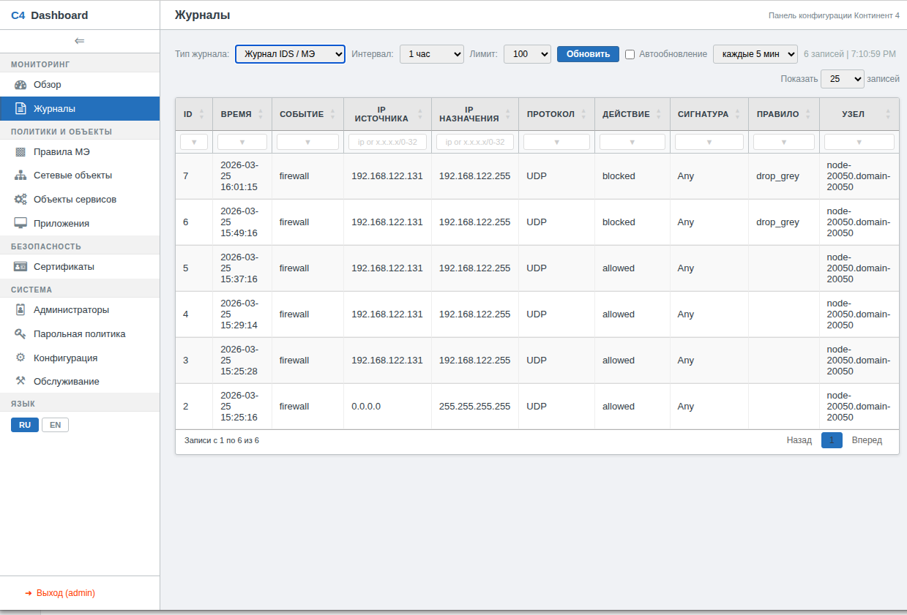 | 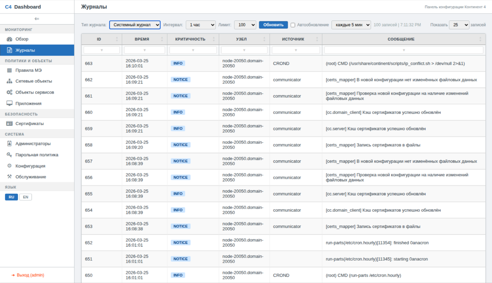 |

| Правила МЭ (скрытие/показ столбцов) | Правила МЭ (выбор политик для экспорта) |
|---|---|
| 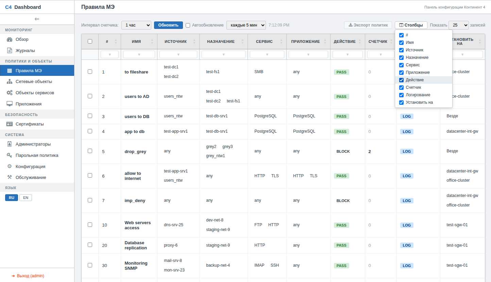 | 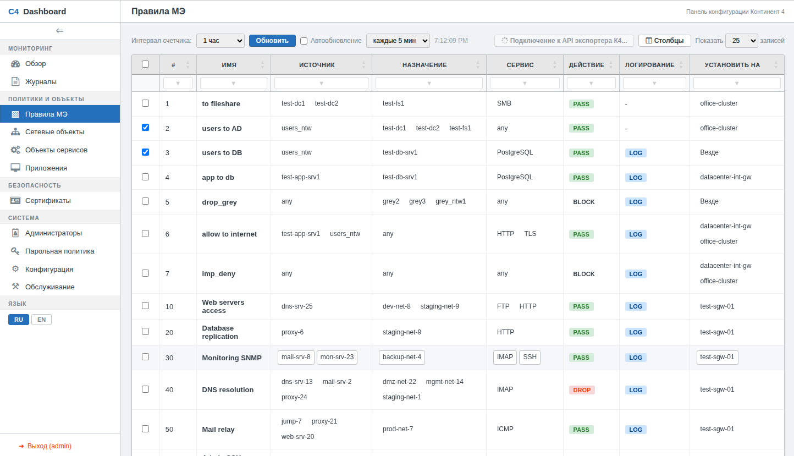 |

| Сетевые объекты | Объекты сервисов |
|---|---|
| 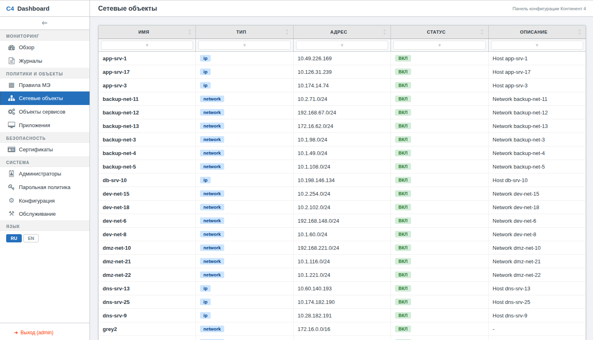 | 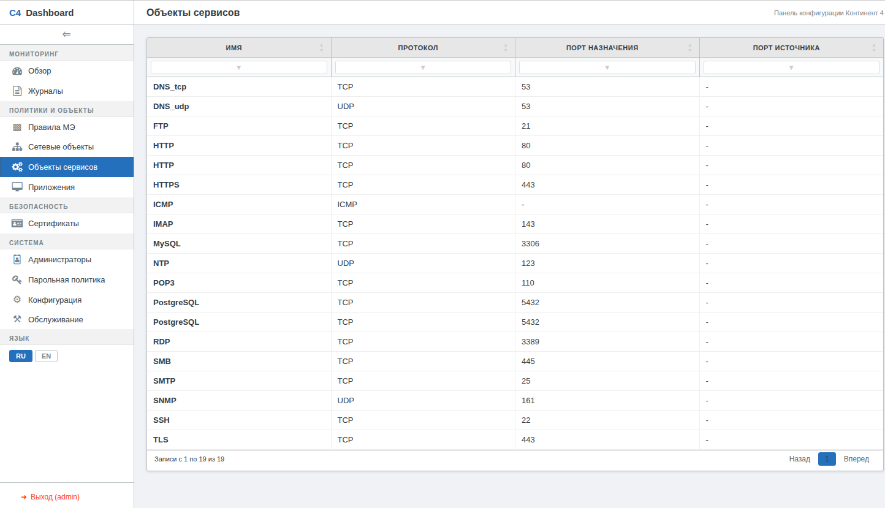 |

| Приложения | Сертификаты |
|---|---|
| 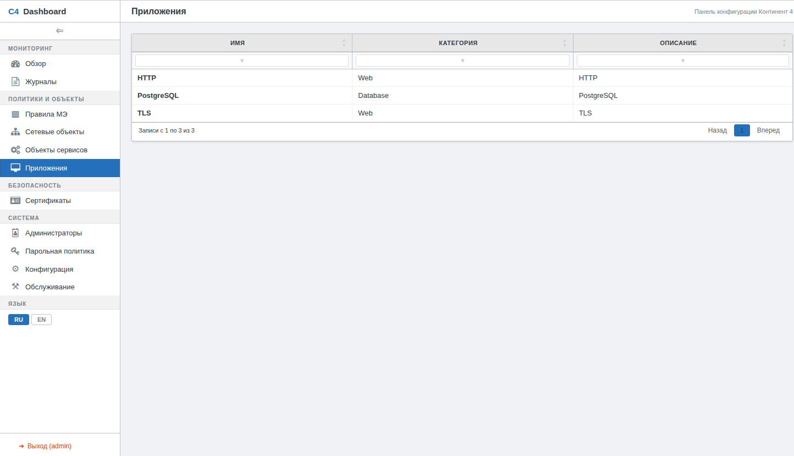 | 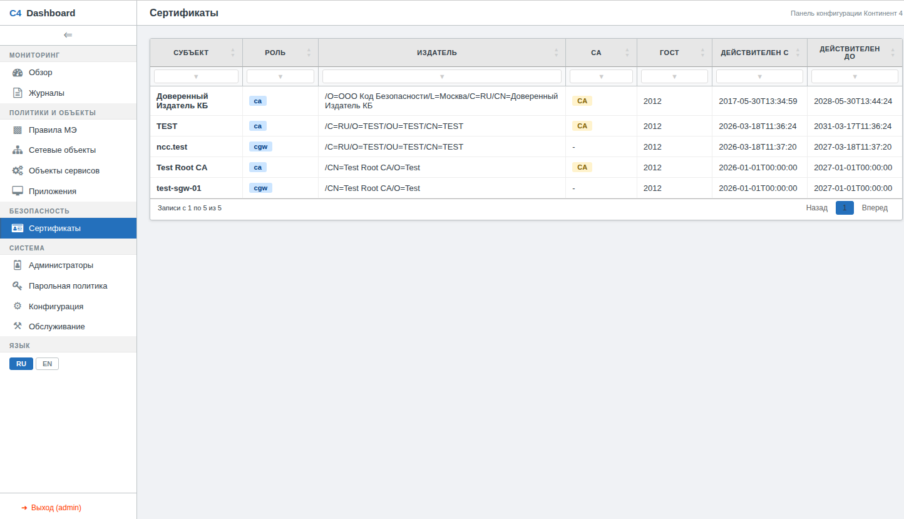 |

| Конфигурация (экспорт, синхронизация, импорт) | Обслуживание (индексы, БД логов ЦУС, автоочистка) |
|---|---|
| 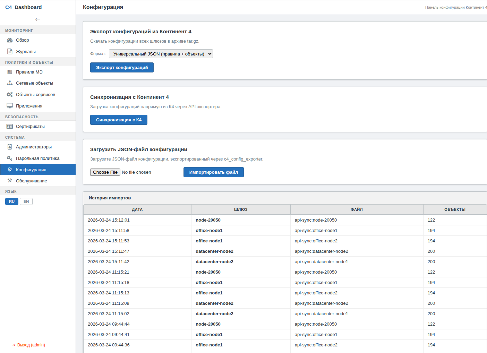 | 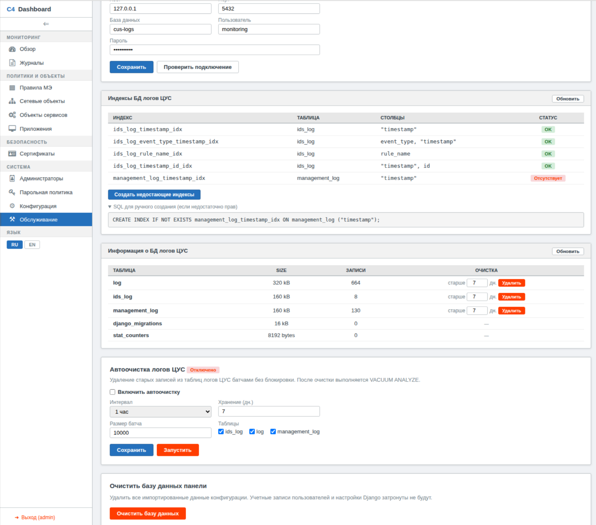 |

## Состав

| Компонент | Описание |
|---|---|
| [c4_dashboard](c4_dashboard/) | Веб-панель конфигурации (Django + c4_lib) |
| [c4_lib-2.0](c4_lib-2.0/) | Библиотека для работы с API Континент 4 (ГОСТ TLS) |
| [dev_env](dev_env/) | Docker Compose для dev-окружения (сборка из исходников, live-reload) |
| [demo](demo/) | Docker Compose для демо-окружения (предсобранные образы) |

## Архитектура

### Demo-окружение (host network)

```
Браузер ──────> nginx :8443 (ГОСТ + RSA TLS)
                       |
              Dashboard :8000 ──────────────────────────> Континент 4 :444
                  |              (c4_lib, встроен в образ)
                  |--> PostgreSQL :5432
                  |--> cus-logs DB
```

c4_lib встроен в образ dashboard — подключается к К4 напрямую, без отдельного сервиса-экспортера. Все сервисы на `network_mode: host`.

### Dev-окружение (host network)

```
Браузер ──────> nginx :8443 (ГОСТ + RSA TLS)
                       |
              Dashboard :8000 ──────────────────────────> Континент 4 :444
                  |              (c4_lib, встроен в образ)
                  |--> PostgreSQL :5432
                  |--> cus-logs DB
```

Та же архитектура, что и демо. Все сервисы на `network_mode: host`. Код монтируется через volume для live-reload. Один `docker-compose.yml` в `dev_env/`.

## Веб-панель (C4 Dashboard)

Разделы интерфейса:

| Раздел | Страницы |
|---|---|
| **Мониторинг** | Обзорная панель (узлы безопасности, домены, статистика объектов, последние импорты), Журналы (системный, управления, IDS/МЭ) |
| **Политики и объекты** | Правила МЭ (источники, назначения, сервисы, приложения, счетчик, установка на узлы, экспорт выбранных политик, скрытие/показ столбцов), Сетевые объекты, Объекты сервисов, Приложения |
| **Безопасность** | Сертификаты (ГОСТ X.509) |
| **Система** | Администраторы, Парольная политика, Конфигурация (экспорт, синхронизация, импорт), Обслуживание |

Страница **Обслуживание** (`/system/maintenance/`):
- Настройка подключения к БД логов ЦУС (хост, порт, БД, пользователь, пароль) с кнопкой проверки
- Проверка и создание индексов БД логов ЦУС (автоматическая проверка, кнопка создания, SQL для ручного создания при недостаточных правах)
- Информация о БД логов ЦУС: список таблиц с размерами и количеством записей
- Очистка таблиц ЦУС: удаление записей старше N дней для каждой таблицы (батчами, без блокировки, с `VACUUM ANALYZE`)
- Автоочистка логов ЦУС: фоновый планировщик с настраиваемым интервалом (10мин–24ч), хранением (дни), выбором таблиц, индикатором статуса и кнопкой ручного запуска
- Статистика базы данных панели
- Очистка базы данных панели

Страница **Обзорная панель** (`/`):
- Карточки статистики: шлюзы, правила МЭ (активные/всего), сетевые объекты, объекты сервисов, приложения, группы объектов, сертификаты, администраторы
- Таблица узлов безопасности (все импортированные шлюзы)
- Таблица доменов
- Последние 10 импортов

Страница **Конфигурация** (`/configuration/`):
- Экспорт конфигураций всех шлюзов в tar.gz архив с выбором формата:
  - **Универсальный JSON** — правила МЭ/NAT с вложенными объектами (источники, назначения, сервисы, приложения, группы), с UUID, готов к анализу и переносу
  - **Исходный JSON** — полная нативная конфигурация К4 как есть
- Пошаговая синхронизация с К4 (список шлюзов → загрузка каждого по отдельности с реальным % прогресса)
- Загрузка JSON-файла конфигурации вручную
- История импортов

Страница **Правила МЭ** (`/firewall/rules/`):
- Экспорт выбранных политик в универсальный JSON — выбор правил чекбоксами, кнопка **Экспорт политик** с индикатором количества, свежий экспорт из К4 с фильтрацией по выбранным правилам и связанным объектам, дедупликация по UUID
- Скрытие/показ столбцов — выпадающее меню **Столбцы** с чекбоксами, сохранение настроек в localStorage

Особенности:
- Прямое подключение к К4 через c4_lib (ГОСТ TLS, встроен в образ)
- Аутентификация (логин/пароль из переменных окружения)
- Локализация: русский (по умолчанию) и английский
- Сворачиваемая боковая панель с тултипами и сохранением состояния в localStorage
- Иконки Font Awesome 4.7 (все статические ресурсы локальные, работает без интернета)
- Фильтрация DataTables: глобальный фильтр + фильтр по каждому столбцу
- Фильтры с поддержкой запятой как OR-разделитель (`HTTP,DNS,SSH` — показать любое совпадение)
- CIDR-фильтрация в столбцах IP журналов (`10.0.0.0/8`, `192.168.0.0/16,10.0.0.0/8`), маски `/0`–`/32`
- Скрытие/показ столбцов DataTables с сохранением в localStorage
- Тултипы на объектах в правилах МЭ (адрес, тип, подсеть/порт)
- Объекты-чипы в колонках Source/Destination/Service/Application/Install on
- Экспорт выбранных политик МЭ в универсальный JSON (свежий экспорт из К4, дедупликация)
- Просмотр журналов ЦУС (log, management_log, ids_log) с автообновлением
- Оптимизация: `prefetch_related` для M2M-связей, индексы на полях name/position/ip/subtype/proto
- Настраиваемые таймауты (`REQUEST_TIMEOUT`, `CONNECT_TIMEOUT`, `UPLOAD_MAX_MB`) через переменные окружения
- Все статические ресурсы (jQuery, DataTables, Font Awesome) локальные — работа без интернета
- Slim Docker-образы (~400 МБ вместо ~1.5 ГБ)

## Демо-окружение

Самый быстрый способ запустить всё — демо-окружение из предсобранных образов (3 контейнера: PostgreSQL, nginx, dashboard):

```bash
# Однократная сборка образов
cd demo
bash build-images.sh

# Запуск
docker compose up -d
```

Панель доступна на `https://localhost:8443` (логин: `admin` / `admin`).

Для переноса на машину без доступа к исходникам:

```bash
# На машине сборки
bash build-images.sh all          # build + export → c4-images.tar.gz

# На целевой машине (нужна только папка demo/)
bash build-images.sh import       # загрузка образов из c4-images.tar.gz
docker compose up -d
```

Подробнее — в [demo/README.md](demo/README.md).

## Быстрый старт (dev-окружение)

```bash
cd dev_env
docker compose up -d --build
```

Один `docker-compose.yml` поднимает все 3 сервиса (PostgreSQL, nginx с ГОСТ, Dashboard). При первом запуске автоматически:
- Создаются базы данных и пользователь (`init-db.sh`)
- Генерируются ГОСТ + RSA сертификаты (PKI)
- Выполняются миграции Django, сбор статики, создание admin-пользователя

Панель доступна:
- `https://127.0.0.1:8443` — через nginx (ГОСТ + RSA TLS)
- `http://127.0.0.1:8000` — напрямую (для отладки)

Логин по умолчанию: `admin` / `admin`

Код `c4_dashboard/` монтируется через volume — изменения применяются без пересборки (live-reload).

### Импорт данных

Через веб-интерфейс **Конфигурация** (`/configuration/`):
- **Синхронизация с К4** — пошаговая загрузка конфигураций всех шлюзов с реальным прогрессом
- **Загрузка JSON** — импорт файлов из `examples/configs/`
- **Экспорт** — скачать конфигурации всех шлюзов в tar.gz

## Подключение к БД логов ЦУС

Панель подключается к внешней БД логов ЦУС для:
- **Счетчик правил МЭ** — подсчет срабатываний по таблице `ids_log`
- **Журналы** — просмотр таблиц `log`, `management_log`, `ids_log`

Параметры подключения настраиваются через веб-интерфейс:
1. Откройте **Система → Обслуживание** (`/system/maintenance/`)
2. В блоке **БД логов ЦУС** укажите хост, порт, имя БД, пользователя и пароль
3. Нажмите **Проверить подключение** для проверки
4. Нажмите **Сохранить**

После подключения автоматически проверяются и создаются индексы на таблицах `ids_log` и `management_log` для ускорения запросов. Если у пользователя БД недостаточно прав — на странице Обслуживание отображается SQL для ручного создания.

Настройки хранятся в БД панели и сохраняются между перезапусками контейнера.

## Индексы БД логов ЦУС

Для ускорения счетчиков правил МЭ и просмотра журналов создаются индексы:

| Индекс | Таблица | Столбцы |
|---|---|---|
| `ids_log_timestamp_idx` | `ids_log` | `timestamp` |
| `ids_log_event_type_timestamp_idx` | `ids_log` | `event_type, timestamp` |
| `ids_log_rule_name_idx` | `ids_log` | `rule_name` |
| `ids_log_timestamp_id_idx` | `ids_log` | `timestamp, id` |
| `management_log_timestamp_idx` | `management_log` | `timestamp` |

Создаются автоматически через веб-интерфейс или вручную: `psql -U monitoring -d cus-logs -f scripts/create_ids_log_indexes.sql`

## Счетчик срабатываний правил МЭ

На странице **Правила МЭ** (`/firewall/rules/`) отображается онлайн-счетчик срабатываний каждого правила из таблицы `ids_log`, сопоставление по полю `rule_name`.

- Выбор интервала: 5 минут, 1 час, 1 день, 1 неделя
- Сортировка по столбцу счетчика
- Ручное обновление кнопкой **Обновить**
- Автообновление с интервалом 1 мин или 5 мин (чекбокс **Автообновление**)
- API-эндпоинт: `GET /api/rule-counters/?interval=5m|1h|1d|1w`

## Экспорт выбранных политик МЭ

На странице **Правила МЭ** можно выбрать конкретные правила чекбоксами и экспортировать их в универсальный JSON:

- Чекбоксы для выбора отдельных правил + **Выбрать все**
- Кнопка **Экспорт политик** (активируется при выборе, показывает количество)
- При нажатии — свежий экспорт конфигураций из К4 через API, конвертация в универсальный формат, фильтрация по выбранным правилам
- Результат: JSON-файл с правилами и вложенными объектами (источники, назначения, сервисы, приложения, группы с участниками, узлы установки), с UUID
- Дедупликация правил по UUID (одно правило на нескольких шлюзах экспортируется один раз)
- API-эндпоинт: `POST /api/export-policies/` с телом `{"names": ["rule1", "rule2"]}`

## Журналы ЦУС

На странице **Журналы** (`/monitor/logs/`) доступен просмотр трех типов журналов из БД логов ЦУС:

| Журнал | Таблица | Описание |
|---|---|---|
| Системный журнал | `log` | Syslog: severity, hostname, source, message |
| Журнал управления | `management_log` | Действия администраторов: category, subject, action |
| Журнал IDS / МЭ | `ids_log` | Firewall-события: src/dst IP, proto, action, signature, rule |

- Выбор интервала и лимита записей
- Фильтр по каждому столбцу
- Автообновление с интервалом 1 мин или 5 мин
- API-эндпоинт: `GET /api/logs/?table=log|management_log|ids_log&interval=1h&limit=100`

## Очистка логов ЦУС

Два варианта:

### Через веб-интерфейс (рекомендуется)
На странице **Обслуживание** — блок **Автоочистка логов ЦУС**:
- Включение/отключение автоочистки
- Настройка интервала (10мин–24ч), хранения (дни), выбор таблиц
- Кнопка ручного запуска
- Батчевое удаление с `VACUUM ANALYZE`

### Скрипт для crontab
Скрипт `scripts/ids_log_cleanup.sh` — мониторинг свободного места на разделе `/var` хоста с БД логов ЦУС:

```bash
cp scripts/ids_log_cleanup.sh /opt/scripts/
crontab -e
*/10 * * * * /opt/scripts/ids_log_cleanup.sh >> /var/log/ids_log_cleanup.log 2>&1
```

| Параметр | По умолчанию | Описание |
|---|---|---|
| `THRESHOLD_PERCENT` | `20` | Порог свободного места (%) |
| `RETENTION_DAYS` | `7` | Удалять записи старше N дней |

## Порты (dev)

| Порт | Сервис | Протокол |
|---|---|---|
| `5432` | PostgreSQL | TCP |
| `8000` | Django (dashboard) | HTTP (localhost) |
| `8443` | nginx → dashboard | ГОСТ + RSA TLS |

## Переменные окружения

### Dashboard

| Переменная | По умолчанию | Описание |
|---|---|---|
| `DASHBOARD_ADMIN_USER` | `admin` | Логин администратора |
| `DASHBOARD_ADMIN_PASSWORD` | `admin` | Пароль администратора |
| `DB_HOST` | `127.0.0.1` | Хост PostgreSQL |
| `DB_NAME` | `monitoring` | БД панели |
| `C4_HOST` | — | IP сервера Континент 4 |
| `C4_PORT` | `444` | Порт Континент 4 |
| `C4_USER` | `admin` | Пользователь К4 |
| `C4_PASSWORD` | — | Пароль К4 |
| `C4_CONNECT_CERT` | — | Клиентский сертификат для mTLS к К4 |
| `C4_CONNECT_KEY` | — | Ключ клиентского сертификата |
| `C4_CONNECT_CA` | — | CA для проверки сервера К4 |
| `CONNECT_TIMEOUT` | `10` | Таймаут подключения к К4 (сек) |
| `REQUEST_TIMEOUT` | `300` | Таймаут чтения от К4 (сек) |
| `UPLOAD_MAX_MB` | `100` | Макс. размер загружаемого файла (МБ) |
| `BIND_ADDRESS` | `127.0.0.1:8000` | Адрес прослушивания Django |
| `DJANGO_LOG_LEVEL` | `INFO` | Уровень логирования (`DEBUG` для отладки) |

## Модели данных

Панель хранит следующие сущности, извлеченные из JSON-конфигурации К4:

| Модель | Описание |
|---|---|
| **Gateway** | Узел безопасности (УБ): платформа, серийный номер |
| **Domain** | Домен управления |
| **NetworkInterface** | Сетевые интерфейсы с адресами |
| **StaticRoute** | Записи таблицы маршрутизации |
| **FirewallRule** | Правила МЭ с M2M-связями к источникам, назначениям, сервисам, приложениям, узлам установки |
| **Application** | Приложения L7 (PostgreSQL, HTTP, TLS, ...) с категориями |
| **NetworkObject** | Сетевые объекты (хосты и подсети) |
| **ServiceObject** | Объекты сервисов (HTTP, SSH, DNS, ...) с протоколом и портами |
| **ObjectGroup** | Группы сетевых объектов с участниками |
| **Certificate** | Сертификаты X.509 (ГОСТ) |
| **AdminUser** | Учетные записи администраторов |
| **PasswordPolicy** | Политика сложности и срока действия паролей |
| **ConfigImport** | История импортов конфигураций |
| **CleanupSettings** | Настройки автоочистки логов ЦУС |

Связи между объектами импортируются из `link`-объектов конфигурации:

| Связь | Описание |
|---|---|
| `clf_source` → NetworkObject/ObjectGroup | Источники правила МЭ |
| `clf_destination` → NetworkObject/ObjectGroup | Назначения правила МЭ |
| `clf_service` → ServiceObject | Сервисы правила МЭ |
| `rule_applications` → Application | Приложения правила МЭ |
| `install_on` → Gateway | Узлы установки правила МЭ (если не указано — везде) |
| `app_has_category` → appcategory | Категория приложения (Web, Database, ...) |
| `group_member` → NetworkObject | Участники группы объектов |

## ГОСТ-криптография

Все контейнеры, работающие с ГОСТ TLS, собирают [gost-engine](https://github.com/gost-engine/engine) из исходников в многоэтапной сборке Docker (slim-образы, ~280–400 МБ):

- **nginx** — ГОСТ + RSA TLS на одном порту
- **c4_dashboard** — c4_lib с ГОСТ TLS для прямого подключения к API Континент 4

Поддерживаемые алгоритмы:
- Электронная подпись: ГОСТ Р 34.10-2012
- Хеш-функции: ГОСТ Р 34.11-2012
- Шифрование: Кузнечик, Магма
- TLS: GOST2012-KUZNYECHIK-KUZNYECHIKOMAC, GOST2012-MAGMA-MAGMAOMAC

## PKI

ГОСТ-сертификаты генерируются автоматически при первом запуске nginx:

| Сертификат | Назначение |
|---|---|
| `ca.crt` / `ca.key` | ГОСТ CA (подпись клиентских и серверных сертификатов) |
| `nginx.crt` / `nginx.key` | ГОСТ-сертификат nginx (TLS-сервер, mTLS-сервер) |
| `nginx-rsa.crt` / `nginx-rsa.key` | RSA-сертификат nginx (для обычных браузеров) |
| `dashboard.crt` / `dashboard.key` | Клиентский сертификат для dashboard (mTLS) |

Сертификаты хранятся в Docker volume `dev-c4-certs`, монтируемом во все контейнеры как `/etc/c4-certs/` (read-only).
