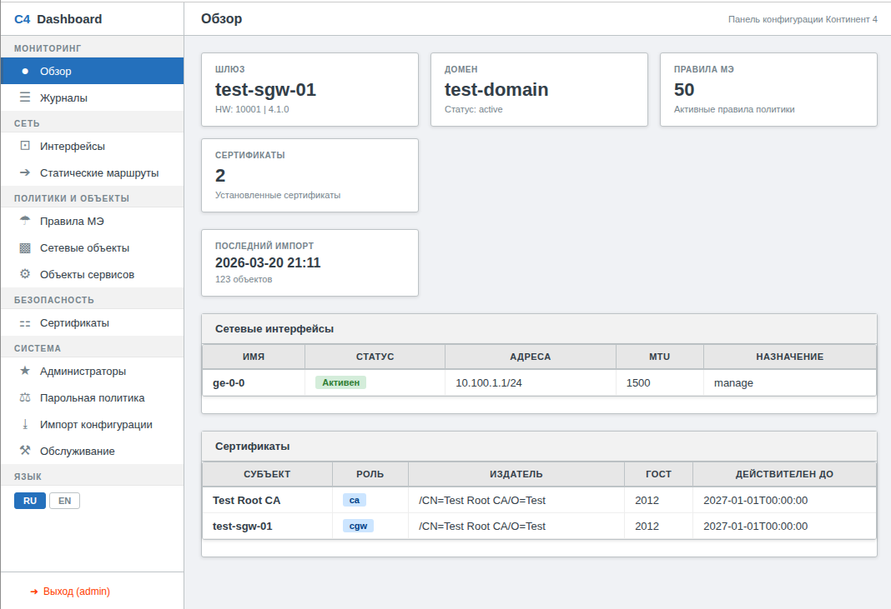
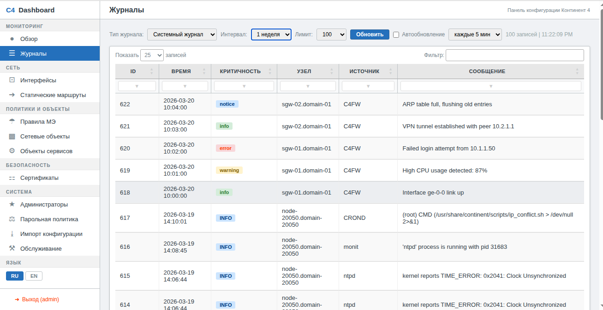
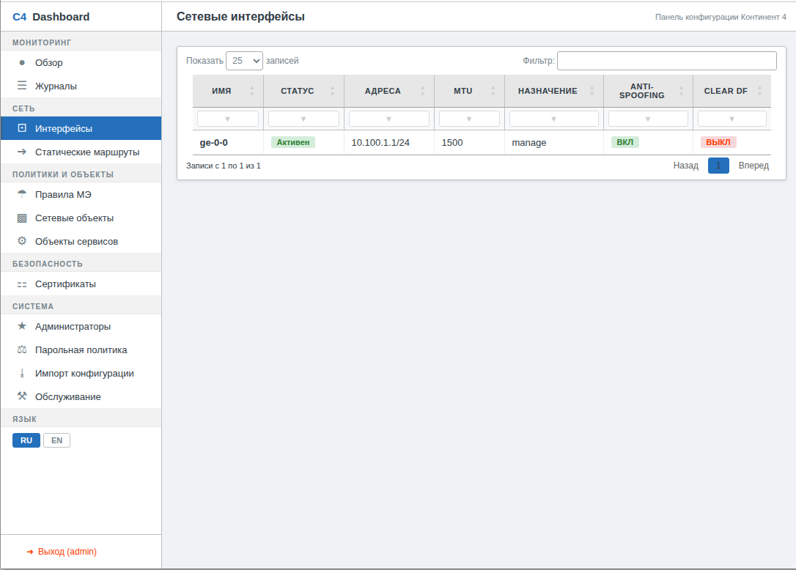
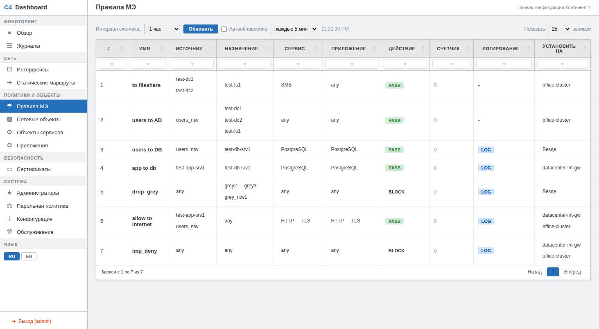
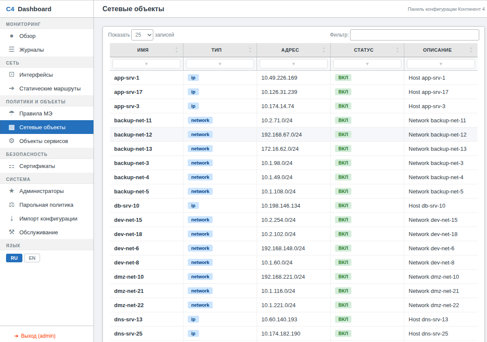
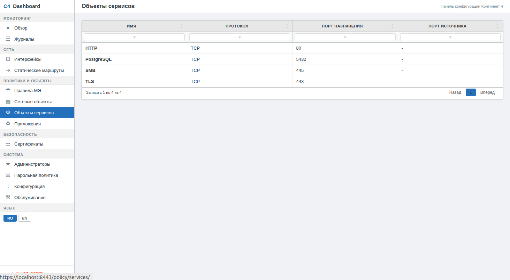
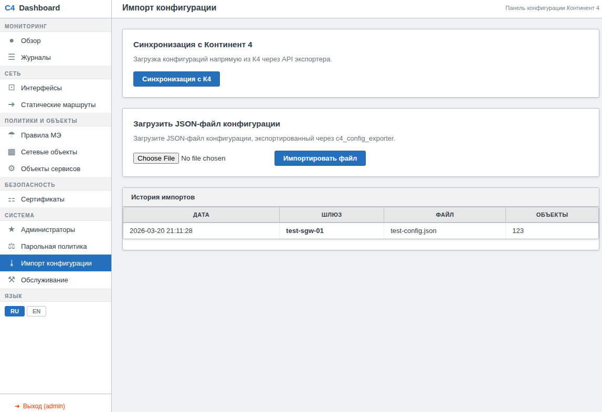
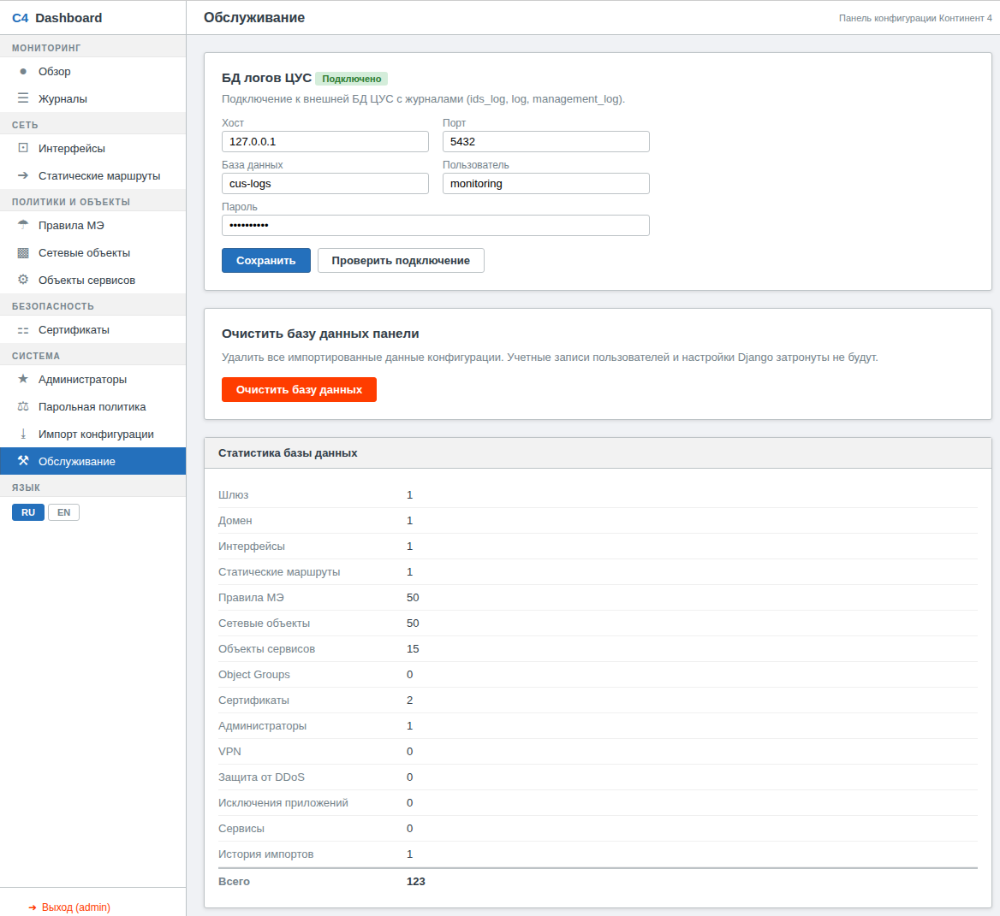

# C4 API Tools

Набор инструментов для работы с API Континент 4: экспорт конфигураций, веб-панель для конфигурации, резервное копирование.

> **ВНИМАНИЕ:** Данный проект предназначен исключительно для образовательных и демонстрационных целей. Не используйте его в продуктивной среде. Конфигурация безопасности (пароли по умолчанию, самоподписанные сертификаты, отключенная верификация TLS) не предназначена для production-развертывания.

## Скриншоты

| Вход | Обзорная панель |
|---|---|
|  |  |

| Журналы ЦУС | Сетевые интерфейсы |
|---|---|
|  |  |

| Правила МЭ (источники, назначения, сервисы, счетчик) | Сетевые объекты |
|---|---|
|  |  |

| Объекты сервисов | Импорт конфигурации |
|---|---|
|  |  |

| Обслуживание (БД логов ЦУС, статистика) |
|---|
|  |

## Состав

| Компонент | Описание |
|---|---|
| [c4_config_exporter](c4_config_exporter/) | CLI и FastAPI-сервис для экспорта конфигураций УБ |
| [c4_dashboard](c4_dashboard/) | Веб-панель конфигурации (Django) |
| [c4_lib-2.0](c4_lib-2.0/) | Библиотека для работы с API Континент 4 (ГОСТ TLS) |
| [c4_backup_tool](c4_backup_tool/) | Инструмент резервного копирования |

## Архитектура dev-окружения

```
Браузер ----->  nginx :8443 (ГОСТ + RSA)        nginx :8444 (ГОСТ mTLS)
                       |                               |
              Dashboard :8000              Exporter API :8001
                  |                                 |
                  |--> PostgreSQL :5432             |--> Континент 4 :444
                  |--> cus-logs DB (ids_log)
```

Все сервисы работают в Docker-контейнерах с `network_mode: host`.

## Веб-панель (C4 Dashboard)

Разделы интерфейса:

| Раздел | Страницы |
|---|---|
| **Мониторинг** | Обзорная панель (шлюз, домен, сертификаты, интерфейсы), Журналы (системный, управления, IDS/МЭ) |
| **Сеть** | Интерфейсы, Статические маршруты |
| **Политики и объекты** | Правила МЭ (с источниками, назначениями, сервисами, счетчиком), Сетевые объекты, Объекты сервисов |
| **Безопасность** | Сертификаты (ГОСТ X.509) |
| **Система** | Администраторы, Парольная политика, Импорт конфигурации, Обслуживание (настройка БД логов, очистка данных) |

Особенности:
- Аутентификация (логин/пароль из переменных окружения)
- Локализация: русский (по умолчанию) и английский
- Фильтрация DataTables: глобальный фильтр + фильтр по каждому столбцу
- Фильтры с поддержкой запятой как OR-разделитель (`HTTP,DNS,SSH` — показать любое совпадение)
- CIDR-фильтрация в столбцах IP журналов (`10.0.0.0/8`, `192.168.0.0/16,10.0.0.0/8`), маски `/0`–`/32`
- Тултипы на объектах в правилах МЭ (адрес, тип, подсеть/порт)
- Объекты-чипы в колонках Source/Destination/Service
- Синхронизация с Континент 4 через ГОСТ mTLS
- Просмотр журналов ЦУС (log, management_log, ids_log) с автообновлением
- Подключение к БД логов ЦУС настраивается через веб-интерфейс (Обслуживание)
- Очистка базы данных через страницу обслуживания

## Быстрый старт

### 1. PostgreSQL

```bash
cd dev_env/dev-postgresql
docker compose up -d

# Первый запуск: создание баз и пользователя
docker exec dev-postgresql psql -U postgres \
  -c "CREATE USER monitoring WITH PASSWORD 'monitoring';" \
  -c "CREATE DATABASE monitoring OWNER monitoring;" \
  -c "CREATE DATABASE \"cus-logs\" OWNER monitoring;" \
  -c "GRANT ALL PRIVILEGES ON DATABASE monitoring TO monitoring;" \
  -c "GRANT ALL PRIVILEGES ON DATABASE \"cus-logs\" TO monitoring;"
```

### 2. Nginx с ГОСТ (PKI)

```bash
cd dev_env/dev-nginx-gost
docker compose build
docker compose up -d
```

При первом запуске автоматически генерируются:
- ГОСТ CA + сертификаты для nginx, dashboard, exporter (mTLS)
- RSA CA + сертификат для nginx (для обычных браузеров)

Сертификаты хранятся в Docker volume `dev-c4-certs` и разделяются между контейнерами.

### 3. C4 Config Exporter API

```bash
cd dev_env/dev-c4-config-exporter
docker compose build
docker compose up -d
```

FastAPI-сервис на порту `8001`. GOST engine собирается из исходников ([gost-engine](https://github.com/gost-engine/engine)) в многоэтапной сборке Docker.

### 4. C4 Dashboard

```bash
cd dev_env/dev-c4-dashboard
docker compose build
docker compose up -d
```

Панель доступна:
- `https://127.0.0.1:8443` — через nginx (ГОСТ + RSA TLS)
- `http://127.0.0.1:8000` — напрямую (для отладки)

Логин по умолчанию: `admin` / `admin`

При запуске контейнера автоматически выполняются:
- Компиляция переводов (`compilemessages`)
- Миграция базы данных (`migrate`)
- Создание/обновление пользователя admin (`ensure_admin`)

### 5. Импорт данных

После запуска всех контейнеров:
1. Откройте `https://127.0.0.1:8443`
2. Войдите как `admin` / `admin`
3. Нажмите **Синхронизация с Континент 4** на главной странице

Или через страницу импорта (`/import/`):
- Синхронизация через API экспортера
- Загрузка JSON-файла конфигурации вручную

## Тестовая конфигурация

Для тестирования без подключения к реальному Континент 4 можно загрузить тестовый файл конфигурации:

Файл: `test-config.json`

Содержимое:
- 1 шлюз (test-sgw-01), 1 домен, 1 интерфейс, 1 маршрут
- 2 сертификата (CA + CGW, ГОСТ 2012)
- 1 администратор, 1 парольная политика
- 50 сетевых объектов (25 хостов + 25 подсетей)
- 15 сервисов (HTTP, HTTPS, SSH, DNS, SMTP, IMAP, RDP, SNMP, PostgreSQL и др.)
- 50 правил МЭ с привязками источников, назначений и сервисов (310 связей)

Загрузка через веб-интерфейс:
1. Откройте `/import/`
2. В блоке **Загрузить JSON-файл конфигурации** выберите `test-config.json`
3. Нажмите **Импортировать файл**

## Подключение к БД логов ЦУС

Панель подключается к внешней БД логов ЦУС для:
- **Счетчик правил МЭ** — подсчет срабатываний по таблице `ids_log`
- **Журналы** — просмотр таблиц `log`, `management_log`, `ids_log`

Параметры подключения настраиваются через веб-интерфейс:
1. Откройте **Система → Обслуживание** (`/system/maintenance/`)
2. В блоке **БД логов ЦУС** укажите хост, порт, имя БД, пользователя и пароль
3. Нажмите **Проверить подключение** для проверки
4. Нажмите **Сохранить**

Настройки хранятся в БД панели и сохраняются между перезапусками контейнера.

Если БД не подключена, на страницах **Правила МЭ** и **Журналы** отображается предупреждение со ссылкой на настройку подключения.

Требования к БД: PostgreSQL с таблицами `ids_log`, `log`, `management_log` стандартной схемы логов Континент 4. Отсутствующие таблицы обрабатываются корректно — API возвращает понятную ошибку.

## Счетчик срабатываний правил МЭ

На странице **Правила МЭ** (`/firewall/rules/`) отображается онлайн-счетчик срабатываний каждого правила из таблицы `ids_log`, сопоставление по полю `rule_name`.

- Выбор интервала: 5 минут, 1 час, 1 день, 1 неделя
- Ручное обновление кнопкой **Обновить**
- Автообновление с интервалом 1 мин или 5 мин (чекбокс **Автообновление**)
- API-эндпоинт: `GET /api/rule-counters/?interval=5m|1h|1d|1w`

## Журналы ЦУС

На странице **Журналы** (`/monitor/logs/`) доступен просмотр трех типов журналов из БД логов ЦУС:

| Журнал | Таблица | Описание |
|---|---|---|
| Системный журнал | `log` | Syslog: severity, hostname, source, message |
| Журнал управления | `management_log` | Действия администраторов: category, subject, action |
| Журнал IDS / МЭ | `ids_log` | Firewall-события: src/dst IP, proto, action, signature, rule |

- Выбор интервала и лимита записей
- Фильтр по каждому столбцу
- Автообновление с интервалом 1 мин или 5 мин
- API-эндпоинт: `GET /api/logs/?table=log|management_log|ids_log&interval=1h&limit=100`

## Очистка логов ЦУС (ids_log)

Скрипт `scripts/ids_log_cleanup.sh` — мониторинг свободного места на разделе `/var` хоста с БД логов ЦУС. При заполнении диска автоматически удаляет старые записи из таблицы `ids_log` без блокировки таблицы.

Логика работы:
1. Проверяет свободное место на `/var`
2. Если свободно менее 20% — удаляет записи старше 7 дней (батчами по 10000 с `FOR UPDATE SKIP LOCKED`, пауза 1 сек между батчами)
3. Выполняет `VACUUM ANALYZE ids_log` (без блокировки таблицы — чтение и запись продолжают работать)
4. Логирует результат

> **Примечание:** `VACUUM ANALYZE` позволяет PostgreSQL переиспользовать освобожденное место, но не возвращает его операционной системе. Для полного возврата места на диск без блокировки таблицы рекомендуется использовать [`pgcompacttable`](https://github.com/dataegret/pgcompacttable) — не требует установки расширений в PostgreSQL, работает через обычные SQL-команды. Альтернатива — `pg_repack` (требует установки расширения в БД).

Установка на хосте с БД:
```bash
# Скопировать скрипт
cp scripts/ids_log_cleanup.sh /opt/scripts/

# Добавить в crontab (каждые 10 минут)
crontab -e
*/10 * * * * /opt/scripts/ids_log_cleanup.sh >> /var/log/ids_log_cleanup.log 2>&1
```

Настраиваемые параметры (в начале скрипта):

| Параметр | По умолчанию | Описание |
|---|---|---|
| `DB_HOST` | `127.0.0.1` | Хост PostgreSQL |
| `DB_PORT` | `5432` | Порт PostgreSQL |
| `DB_NAME` | `cus-logs` | Имя базы данных |
| `DB_USER` | `monitoring` | Пользователь БД |
| `PGPASSWORD` | `monitoring` | Пароль БД |
| `THRESHOLD_PERCENT` | `20` | Порог свободного места (%) |
| `RETENTION_DAYS` | `7` | Удалять записи старше N дней |
| `PARTITION` | `/var` | Раздел для мониторинга |

Требования: `psql` (пакет `postgresql-client`).

## Порядок запуска

```
1. dev-postgresql          (PostgreSQL 16)
2. dev-nginx-gost          (nginx + ГОСТ, генерация PKI)
3. dev-c4-config-exporter  (FastAPI + ГОСТ TLS к Континент 4)
4. dev-c4-dashboard        (Django + mTLS к экспортеру)
```

## Порядок остановки

```bash
# Остановка всех контейнеров
docker stop dev-c4-dashboard dev-c4-config-exporter dev-nginx-gost dev-postgresql

# Или по отдельности из соответствующих директорий
cd dev_env/dev-c4-dashboard && docker compose down
cd dev_env/dev-c4-config-exporter && docker compose down
cd dev_env/dev-nginx-gost && docker compose down
cd dev_env/dev-postgresql && docker compose down
```

## Порты

| Порт | Сервис | Протокол |
|---|---|---|
| `5432` | PostgreSQL | TCP |
| `8000` | Django (dashboard) | HTTP |
| `8001` | FastAPI (exporter) | HTTP |
| `8443` | nginx → dashboard | ГОСТ + RSA TLS |
| `8444` | nginx → exporter | ГОСТ mTLS |

## Переменные окружения

Все переменные настраиваются в `docker-compose.yml` соответствующего сервиса.

### Dashboard (`dev_env/dev-c4-dashboard/docker-compose.yml`)

| Переменная | По умолчанию | Описание |
|---|---|---|
| `DASHBOARD_ADMIN_USER` | `admin` | Логин администратора |
| `DASHBOARD_ADMIN_PASSWORD` | `admin` | Пароль администратора |
| `DB_HOST` | `127.0.0.1` | Хост PostgreSQL |
| `DB_NAME` | `monitoring` | БД панели |
| `C4_EXPORTER_API_URL` | `https://127.0.0.1:8444` | URL API экспортера (через nginx mTLS) |


### Exporter (`dev_env/dev-c4-config-exporter/docker-compose.yml`)

| Переменная | По умолчанию | Описание |
|---|---|---|
| `C4_HOST` | `192.168.122.200` | IP сервера Континент 4 |
| `C4_PORT` | `444` | Порт Континент 4 |
| `C4_USER` | `admin` | Пользователь К4 |
| `C4_PASSWORD` | - | Пароль К4 |

Полный список переменных — в README каждого компонента.

## Модели данных

Панель хранит следующие сущности, извлеченные из JSON-конфигурации К4:

| Модель | Описание |
|---|---|
| **Gateway** | Узел безопасности (УБ): платформа, серийный номер |
| **Domain** | Домен управления |
| **NetworkInterface** | Сетевые интерфейсы с адресами |
| **StaticRoute** | Записи таблицы маршрутизации |
| **FirewallRule** | Правила МЭ с M2M-связями к источникам, назначениям, сервисам |
| **NetworkObject** | Сетевые объекты (хосты и подсети) |
| **ServiceObject** | Объекты сервисов (HTTP, SSH, DNS, ...) с протоколом и портами |
| **ObjectGroup** | Группы сетевых объектов с участниками |
| **Certificate** | Сертификаты X.509 (ГОСТ) |
| **AdminUser** | Учетные записи администраторов |
| **PasswordPolicy** | Политика сложности и срока действия паролей |
| **ConfigImport** | История импортов конфигураций |

Связи между объектами импортируются из `link`-объектов конфигурации:

| Связь | Описание |
|---|---|
| `clf_source` → NetworkObject/ObjectGroup | Источники правила МЭ |
| `clf_destination` → NetworkObject/ObjectGroup | Назначения правила МЭ |
| `clf_service` → ServiceObject | Сервисы правила МЭ |
| `group_member` → NetworkObject | Участники группы объектов |

## ГОСТ-криптография

Все контейнеры, работающие с ГОСТ TLS, собирают [gost-engine](https://github.com/gost-engine/engine) из исходников в многоэтапной сборке Docker (без предкомпилированных бинарных файлов):

- **nginx** — ГОСТ + RSA TLS на одном порту, ГОСТ mTLS для внутренних сервисов
- **c4_config_exporter** — ГОСТ TLS для подключения к API Континент 4
- **c4_dashboard** — ГОСТ TLS для mTLS-соединений с экспортером через nginx

Поддерживаемые алгоритмы:
- Электронная подпись: ГОСТ Р 34.10-2012
- Хеш-функции: ГОСТ Р 34.11-2012
- Шифрование: Кузнечик, Магма
- TLS: GOST2012-KUZNYECHIK-KUZNYECHIKOMAC, GOST2012-MAGMA-MAGMAOMAC

Подробнее — в [c4_config_exporter/README.md](c4_config_exporter/README.md).

## PKI

ГОСТ-сертификаты генерируются автоматически при первом запуске `dev-nginx-gost`:

| Сертификат | Назначение |
|---|---|
| `ca.crt` / `ca.key` | ГОСТ CA (подпись клиентских и серверных сертификатов) |
| `nginx.crt` / `nginx.key` | ГОСТ-сертификат nginx (TLS-сервер, mTLS-сервер) |
| `nginx-rsa.crt` / `nginx-rsa.key` | RSA-сертификат nginx (для обычных браузеров) |
| `dashboard.crt` / `dashboard.key` | Клиентский сертификат для dashboard (mTLS) |
| `exporter.crt` / `exporter.key` | Клиентский сертификат для exporter (mTLS) |

Сертификаты хранятся в Docker volume `dev-c4-certs`, монтируемом во все контейнеры как `/etc/c4-certs/` (read-only).

Для перегенерации сертификатов:
```bash
docker stop dev-nginx-gost dev-c4-dashboard dev-c4-config-exporter
docker rm dev-nginx-gost dev-c4-dashboard dev-c4-config-exporter
docker volume rm dev-c4-certs
cd dev_env/dev-nginx-gost && docker compose up -d
# Затем запустить остальные контейнеры
```
